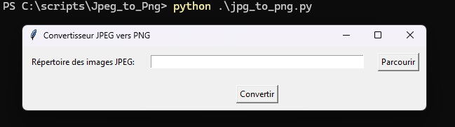

```markdown
# JPEG to PNG Converter

A simple Python GUI application to convert all JPEG images in a selected directory to PNG format.

## Table of Contents

- [Features](#features)
- [How It Works](#how-it-works)
- [Installation](#installation)
- [Usage](#usage)
- [Screenshot](#screenshot)

## Features

- Select a directory containing JPEG images.
- Converts all `.jpeg` files in the chosen directory to `.png`.
- Saves converted images in a new `converted` subdirectory within the original directory.
- User-friendly graphical interface.

## How It Works

The application uses `tkinter` for the graphical interface and `Pillow` (PIL Fork) for image processing.
1. The user selects an input directory.
2. The application iterates through all files in the selected directory.
3. If a file has a `.jpeg` extension (case-insensitive), it is opened using Pillow.
4. The image is then saved in PNG format into a new `converted` folder, maintaining the original filename.

## Installation

1. **Clone the repository:**
   ```bash
   git clone https://github.com/Yanosh77/jpeg_to_pgn.git
   cd jpeg_to_pgn
   ```

2. **Install dependencies:**
   This project requires `Pillow`. You can install it using pip:
   ```bash
   pip install Pillow
   ```

## Usage

1. **Run the script:**
   ```bash
   python jpg_to_png.py
   ```

2. **Select Directory:** Click the "Browse" button to choose the directory containing your `.jpeg` images.

3. **Convert:** Click the "Convert" button to start the conversion process. A "converted" folder will be created in your selected directory, containing the new PNG images.

## Screenshot



## Contributing

Feel free to fork the repository, make improvements, and submit pull requests.

## License

This project is open source.

---

# Convertisseur JPEG vers PNG

Une simple application GUI Python pour convertir toutes les images JPEG d'un répertoire sélectionné au format PNG.

## Table des matières

- [Fonctionnalités](#fonctionnalités)
- [Comment ça marche](#comment-ça-marche)
- [Installation](#installation-1)
- [Utilisation](#utilisation-1)
- [Capture d'écran](#capture-d'écran-1)
- [Contribuer](#contribuer-1)
- [Licence](#licence-1)

## Fonctionnalités

- Sélectionne un répertoire contenant des images JPEG.
- Convertit tous les fichiers `.jpeg` du répertoire choisi en `.png`.
- Sauvegarde les images converties dans un nouveau sous-répertoire `converted` à l'intérieur du répertoire d'origine.
- Interface graphique conviviale.

## Comment ça marche

L'application utilise `tkinter` pour l'interface graphique et `Pillow` (Fork de PIL) pour le traitement des images.
1. L'utilisateur sélectionne un répertoire d'entrée.
2. L'application parcourt tous les fichiers du répertoire sélectionné.
3. Si un fichier a une extension `.jpeg` (insensible à la casse), il est ouvert à l'aide de Pillow.
4. L'image est ensuite enregistrée au format PNG dans un nouveau dossier `converted`, en conservant le nom de fichier original.

## Installation

1. **Cloner le dépôt :**
   ```bash
   git clone https://github.com/Yanosh77/jpeg_to_pgn.git
   cd jpeg_to_pgn
   ```

2. **Installer les dépendances :**
   Ce projet nécessite `Pillow`. Vous pouvez l'installer en utilisant pip :
   ```bash
   pip install Pillow
   ```

## Utilisation

1. **Exécuter le script :**
   ```bash
   python jpg_to_png.py
   ```

2. **Sélectionner le répertoire :** Cliquez sur le bouton "Parcourir" pour choisir le répertoire contenant vos images `.jpeg`.

3. **Convertir :** Cliquez sur le bouton "Convertir" pour lancer le processus de conversion. Un dossier "converted" sera créé dans votre répertoire sélectionné, contenant les nouvelles images PNG.

## Contribuer

N'hésitez pas à forker le dépôt, à apporter des améliorations et à soumettre des pull requests.

## Licence

Ce projet est open source.
```
